# littleSystem

## Build the build environment with docker
```bash
docker build -t ubuntu-22.04-build-env docker
```

```bash
echo "$USER ALL=(ALL) NOPASSWD: ALL" | sudo tee -a /etc/sudoers

docker run --privileged -it \
    -v $PWD:/workspace \
    --mount type=bind,source=/dev,target=/dev \
    --mount type=bind,source=/etc/passwd,target=/etc/passwd \
    --mount type=bind,source=/etc/group,target=/etc/group \
    --mount type=bind,source=/etc/shadow,target=/etc/shadow \
    --mount type=bind,source=/etc/sudoers,target=/etc/sudoers \
    --user $UID:$GID \
    ubuntu-22.04-build-env
```
## into docker build

### kernel
```bash
./build.sh kernel
```

### alpine
```bash
./build.sh alpine
```

### rootfs
```bash
./build.sh rootfs
```

### ramdisk
```bash
build ramdisk encrypted.img
./build.sh ramdisk
```


### uboot
```bash
./build.sh uboot
```

### fit-boot
```bash
./build.sh fit-boot
```

### sign-boot
```bash
./build.sh sign-boot
```

### update image
```bash
./build.sh update
```

### all
```bash
all: kernel alpine rootfs ramdisk uboot fit-boot sign-boot update
./build.sh all
```
### building process


